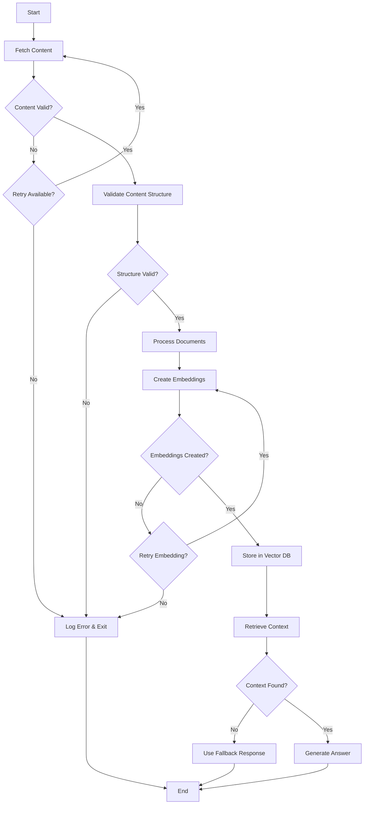

# 🔍 Multi-URL RAG System with LangChain & LangGraph

A production-ready question-answering system that fetches content from multiple URLs and generates intelligent answers using Retrieval-Augmented Generation (RAG) with LangChain and LangGraph orchestration.

[](https://www.python.org/downloads/)
[](https://www.langchain.com/)
[](https://langchain-ai.github.io/langgraph/)

## Video

> https://github.com/user-attachments/assets/c3003550-816b-4bce-995d-a39739005319

## Images
> ### Can fill in the blanks, based on the given context
> 
---
> ### Can tell if the sentence is true or false
> 


## 🌟 Overview

This system demonstrates advanced **LangChain** and **LangGraph** capabilities to build a robust multi-source RAG pipeline that:

- Fetches and processes content from multiple web URLs
- Creates semantic embeddings using FAISS vector store
- Orchestrates complex workflows with LangGraph state machines
- Generates contextual answers with retry logic and error handling
- Provides an interactive Gradio interface for easy use

## 🎯 Key Features

### LangChain Integration
- **Document Processing**: Uses `RecursiveCharacterTextSplitter` for intelligent chunking
- **Vector Store**: FAISS-based semantic search with HuggingFace embeddings
- **LLM Integration**: OpenRouter API integration via `ChatOpenAI`
- **Prompt Engineering**: Structured prompts with `ChatPromptTemplate`
- **Chain Composition**: LCEL (LangChain Expression Language) for pipeline building

### LangGraph Orchestration
- **State Management**: Type-safe state definitions with `TypedDict`
- **Conditional Routing**: Dynamic workflow paths based on processing outcomes
- **Error Handling**: Automatic retry logic with configurable attempts
- **Memory Persistence**: `MemorySaver` for conversation history
- **Graph-based Workflow**: Visual workflow with 7 interconnected nodes

## 🏗️ Architecture

### LangGraph Workflow



### State Graph Nodes

1. **fetch_content_node** - Retrieves content from URLs with retry support
2. **validate_content_node** - Ensures content quality and length
3. **process_documents_node** - Chunks documents with metadata
4. **create_embeddings_node** - Builds FAISS vector store
5. **retrieve_context_node** - Performs semantic search
6. **generate_answer_node** - Generates LLM response with citations
7. **handle_error_node** - Graceful error recovery

## 🚀 Getting Started

### Prerequisites

```bash
Python 3.8+
OpenRouter API Key
```

### Installation

```bash
# Clone the repository
git clone https://github.com/ArjunJagdale/URAG.git
cd URAG

# Install dependencies
pip install -r requirements.txt
```

### Required Dependencies

```txt
langchain
langchain-community
langchain-openai
langgraph
faiss-cpu
sentence-transformers
beautifulsoup4
requests
gradio
```

### Environment Setup

```bash
# Set your OpenRouter API key
export OPENROUTER_API_KEY="your-api-key-here"
```

Or create a `.env` file:
```
OPENROUTER_API_KEY=your-api-key-here
```

### Running the Application

```bash
python app.py
```

The Gradio interface will launch at `http://localhost:7860`

## 💡 Usage Example

### Basic Usage

```python
from multi_url_rag import MultiURLRAGSystem

# Initialize system
rag_system = MultiURLRAGSystem(openrouter_api_key="your-key")

# Process query
urls = [
    "https://example.com/article1",
    "https://example.com/article2"
]

result = rag_system.process_query(
    urls=urls,
    query="What are the main topics discussed?",
    answer_length="medium"
)

print(result["final_answer"])
print(result["citations"])
```

### Via Gradio Interface

1. **Enter URLs** (one per line)
2. **Type your question**
3. **Select answer length** (short/medium/detailed)
4. **Click "Get Answer"**
5. **View AI-generated response with citations**

## 🔧 LangChain Components Deep Dive

### Document Processing

```python
text_splitter = RecursiveCharacterTextSplitter(
    chunk_size=1000,
    chunk_overlap=200,
    length_function=len,
    separators=["\n\n", "\n", ". ", " ", ""]
)
```

- **Intelligent chunking** preserves semantic coherence
- **Overlap strategy** maintains context between chunks
- **Metadata tracking** for source attribution

### Embeddings & Vector Store

```python
embeddings = HuggingFaceEmbeddings(
    model_name="sentence-transformers/all-MiniLM-L6-v2"
)

vector_store = FAISS.from_documents(
    documents,
    embeddings
)
```

- **Local embeddings** (no API calls)
- **Fast similarity search** with FAISS indexing
- **Efficient retrieval** with configurable top-k

### LLM Chain with LCEL

```python
chain = prompt | self.llm | StrOutputParser()

answer = chain.invoke({
    "context": formatted_context,
    "question": user_query,
    "length_instruction": instruction
})
```

- **Composable chains** using pipe operator
- **Structured prompts** for consistent outputs
- **Streaming support** (future enhancement)

## 🕸️ LangGraph State Management

### State Definition

```python
class RAGState(TypedDict):
    urls: List[str]
    raw_content: Dict[str, str]
    documents: List[Document]
    query: str
    answer_length: str
    retrieved_docs: List[Document]
    final_answer: str
    citations: List[Dict[str, str]]
    error_messages: List[str]
    processing_status: str
    retry_count: int
```

### Conditional Routing

```python
workflow.add_conditional_edges(
    "fetch_content",
    should_continue_after_fetch,
    {"continue": "validate_content", "error": "handle_error"}
)
```

- **Dynamic paths** based on processing results
- **Retry logic** for transient failures
- **Error isolation** with dedicated handler

### Memory Persistence

```python
memory = MemorySaver()
graph = workflow.compile(checkpointer=memory)

config = {"configurable": {"thread_id": "session_1"}}
result = graph.invoke(initial_state, config)
```

- **Conversation tracking** across invocations
- **State checkpointing** for debugging
- **Thread-based isolation** for multi-user scenarios

## 📊 Answer Length Configuration

| Length | Chunks Retrieved | Output Style |
|--------|------------------|--------------|
| **Short** | 3 | 2-3 sentences |
| **Medium** | 6 | 2-3 paragraphs |
| **Detailed** | 10 | Multiple paragraphs with depth |

## 🛠️ Advanced Features

### Retry Mechanism

- Automatic retry for failed URL fetches (up to 2 attempts)
- Exponential backoff can be added for production use

### Content Validation

- Minimum word count threshold (50 words)
- HTML cleaning and text extraction
- Paywall detection

### Citation Tracking

- Automatic source attribution
- Unique URL deduplication
- Chunk-level metadata preservation

## 🔒 Error Handling

The system includes comprehensive error handling:

- **Network failures** - Retry with exponential backoff
- **Content validation** - Skip low-quality sources
- **Embedding errors** - Graceful degradation
- **LLM failures** - Fallback responses

## 🎨 Customization

### Change LLM Model

```python
self.llm = ChatOpenAI(
    base_url="https://openrouter.ai/api/v1",
    api_key=self.openrouter_api_key,
    model="anthropic/claude-3-sonnet",  # Change model here
    temperature=0.1
)
```

### Adjust Chunk Size

```python
self.text_splitter = RecursiveCharacterTextSplitter(
    chunk_size=1500,  # Increase for more context
    chunk_overlap=300,
    # ...
)
```

### Modify Retrieval Count

```python
k_map = {"short": 5, "medium": 8, "detailed": 15}
```

## 📈 Performance Considerations

- **Embedding Model**: Lightweight all-MiniLM-L6-v2 (fast, good quality)
- **Vector Store**: FAISS CPU (production: consider GPU version)
- **Chunking**: Optimized for 1000 tokens per chunk
- **Caching**: Vector store persists across queries in same session

## 🤝 Contributing

Contributions are welcome! Areas for enhancement:

- [ ] Add streaming responses for real-time output
- [ ] Implement vector store persistence
- [ ] Add support for PDF/document uploads
- [ ] Multi-modal support (images, tables)
- [ ] Advanced citation formatting
- [ ] Query expansion and rewriting

## 📝 License

This project is licensed under the MIT License - see the LICENSE file for details.

## 🙏 Acknowledgments

- **LangChain** - Framework for LLM applications
- **LangGraph** - State machine orchestration
- **FAISS** - Efficient similarity search
- **Gradio** - User interface framework
- **HuggingFace** - Embedding models

## 📧 Contact

**Arjun Jagdale**

- GitHub: [@ArjunJagdale](https://github.com/ArjunJagdale)
- Repository: [URAG](https://github.com/ArjunJagdale/URAG)

---

⭐ If you find this project helpful, please consider giving it a star!
